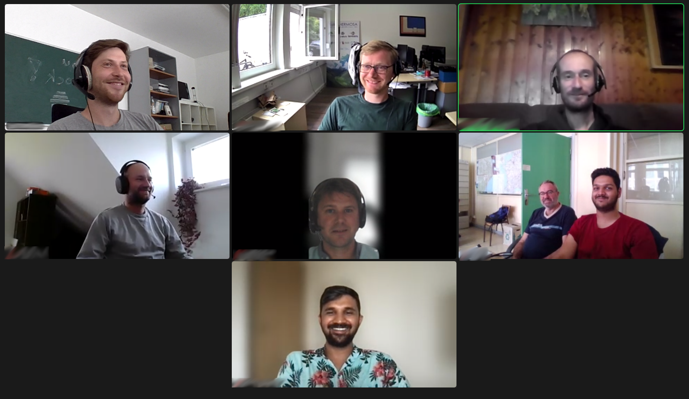

From Tuesday, 07.06 until Friday, 10.06.2022 the first GeoStyler Code Sprint took place. 12 motivated coders from all over the world participated and provided great contributions to the GeoStyler project.

{/* truncate */}

We want to thank everyone who contributed to the GeoStyler project. Thank you for your motivation and engagement, for all your great contributions, for all the ideas that came up during the Code Sprint and for all the fun we had during this week! You are awesome!

Thank you 

[@krishnaglodha](https://github.com/krishnaglodha),
[@slafayIGN](https://github.com/slafayIGN),
[@geographika](https://github.com/geographika),
[@ocruze](https://github.com/ocruze),
[@pprev94](https://github.com/pprev94),
[@annarieger](https://github.com/annarieger),
[@dnlkoch](https://github.com/dnlkoch),
[@kaivolland](https://github.com/kaivolland),
[@hwbllmnn](https://github.com/hwbllmnn),
[@chrismayer](https://github.com/chrismayer),
[@jansule](https://github.com/jansule),
[@vincjo](https://github.com/vincjo)
and Navid.

During the Code Sprint, we achieved the following:

### GeoStyler User Manual

We now have a GeoStyler user manual, which provides a user centric description on how to style geodata with GeoStyler.

The manual is still a work in progress, but the basic functionality is already documented. Check out https://geostyler.github.io/geostyler-cookbook/ for the current state.

Kudos to [@krishnaglodha](https://github.com/krishnaglodha) and [@jansule](https://github.com/jansule).

### GeoStyler CardLayout

In October 2021, a concept for an additional layout for the [GeoStyler UI](https://github.com/geostyler/geostyler) was created and main features were implemented. This layout omits the use of windows and thereby provides a clean and mobile-friendly look. During the Code Sprint, the implementation could be finalized, and the new layout can be used via the `<CardStyle />` component.

Kudos to [@annarieger](https://github.com/annarieger) and [@jansule](https://github.com/jansule).

### GeoStyler GeoServer Plugin

Multiple fixes and improvements were applied to the [GeoStyler community extension for GeoServer](https://docs.geoserver.org/main/en/user/community/geostyler/index.html). Tests were added, deploy pipelines created, the overall integration into GeoServer was improved and a docker based Dev-Setup was created. Also, the extension will now be served under the dedicated repository [geostyler-geoserver-plugin](https://github.com/geostyler/geostyler-geoserver-plugin).

Kudos to [@dnlkoch](https://github.com/dnlkoch).

### Dev-Experience / Dev-Setup

Dev-Experience and Dev-Setup were improved in many different ways. We now have a better support for developing on windows.
Also, the performance for building and working with our interactive documentation was improved drastically.

Kudos to [@slafayIGN](https://github.com/slafayIGN), [@geographika](https://github.com/geographika), [@ocruze](https://github.com/ocruze), [@pprev94](https://github.com/pprev94), [@dnlkoch](https://github.com/dnlkoch) and [@kaivolland](https://github.com/kaivolland).

### Support for Expressions

For quite a while, we were working on the support of expressions in GeoStyler. Through these, it is possible to set styling properties attributively and feature-based, which allows for more compact and dynamic styles. For example, color values can be calculated based on a function that uses attributes of the dataset as function arguments. So instead of providing a single rule for each possible color value respectively, users can now provide a single rule that describes the color value for all features based on a single expression.

Expressions are now supported in the [geostyler-style](https://github.com/geostyler/geostyler-style/) format and was already implemented for the [geostyler-cql-parser](https://github.com/geostyler/geostyler-cql-parser/) and the [geostyler-sld-parser](https://github.com/geostyler/geostyler-sld-parser/). We will work on supporting other parsers in the future.

Kudos to [@hwbllmnn](https://github.com/hwbllmnn).

### French translations

GeoStyler now also supports French.

Kudos to [@slafayIGN](https://github.com/slafayIGN).

### GeoStyler REST API

The [GeoStyler REST API](https://github.com/geostyler/geostyler-rest) was enhanced by providing a new API endpoint `GET /geostyler-rest/api/versions` that gives information about the versions of the used parsers. Besides that, multiple bugfixes and minor improvements were done.

Kudos to [@chrismayer](https://github.com/chrismayer).

### Unsupported properties

The [GeoStyler UI](https://github.com/geostyler/geostyler) as well as the [geostyler-openlayers-parser](https://github.com/geostyler/geostyler-openlayers-parser) and [geostyler-sld-parser](https://github.com/geostyler/geostyler-sld-parser) make now use of the `unsupportedProperties` interface. Due to these changes, the UI now gives hints about properties that were used in the UI but are not supported by a specific parser.

Kudos to [@kaivolland](https://github.com/kaivolland).

### Mapfile validation

The [geostyler-mapfile-parser](https://github.com/geostyler/geostyler-mapfile-parser) will soon be able to validate mapfiles.

Kudos to [@geographika](https://github.com/geographika).

### GeoStyler Demo

The [demo application](https://geostyler.github.io/geostyler-demo/) was improved in multiple ways. The `<PreviewMap />` component now enables zooming and panning in order to verify proper scaleDenominator configuration. The demo now also provides feedback when loading style and/or data. Furthermore, we got rid of using create-react-app and provided our own webpack configuration which facilitates working with linked dependencies.

Kudos to [@ocruze](https://github.com/ocruze), [@pprev94](https://github.com/pprev94), [@hwbllmnn](https://github.com/hwbllmnn) and [@jansule](https://github.com/jansule).

### GeoStyler Mapbox Parser

The [geostyler-mapbox-parser](https://github.com/geostyler/geostyler-mapbox-parser) was improved by fixing the opacity handling for MarkSymbolizer and harmonizing its behaviour with the other parsers.

Kudos to [@ocruze](https://github.com/ocruze) and [@pprev94](https://github.com/pprev94).

### Refactorings

All class based React components were refactored into the more compact and better maintainable function based components.

Kudos to [@kaivolland](https://github.com/kaivolland).

### Bugfixes

The [geostyler-cli](https://github.com/geostyler/geostyler-cli) now also works properly on windows.

Kudos to [@geographika](https://github.com/geographika).

### Conference talks and other media

GeoStyler will be featured on multiple talks on FOSS4G 2022. Also, there will be videos published on how to work with GeoStyler.

Kudos to everyone!

Again, we want to thank everyone who participated in this Code Sprint. It was great fun and an absolute pleasure working with you!

