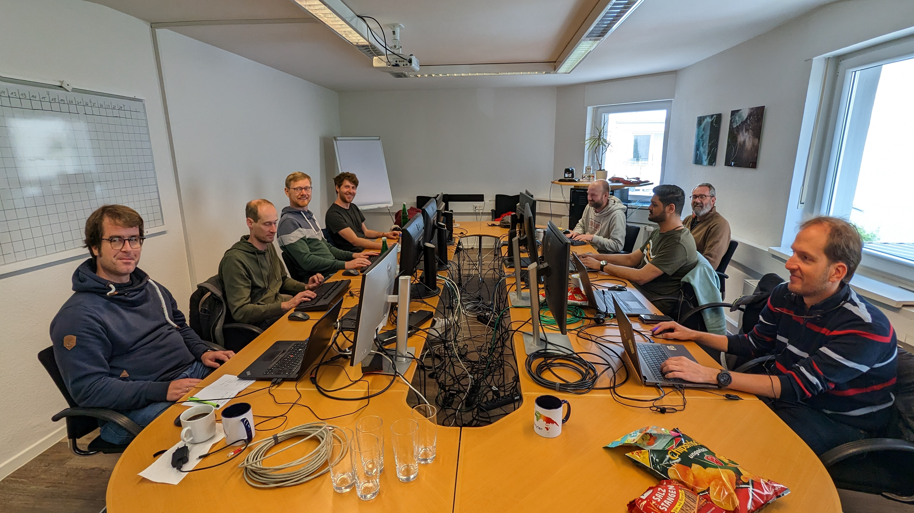
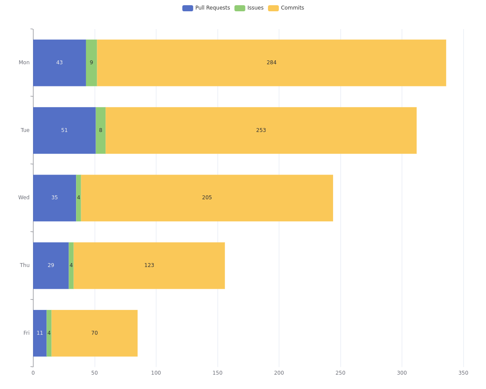
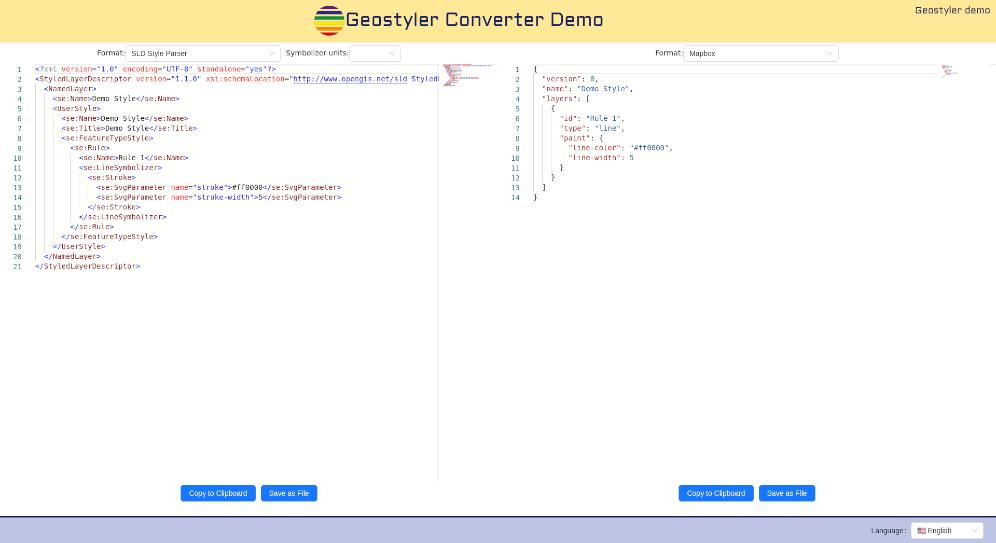
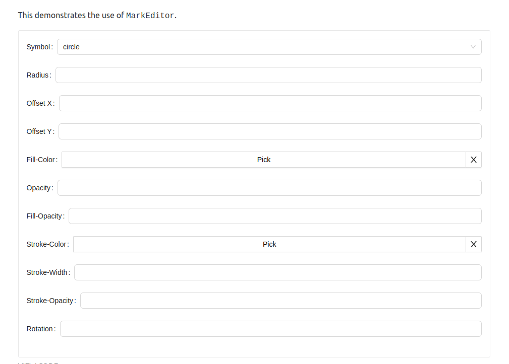
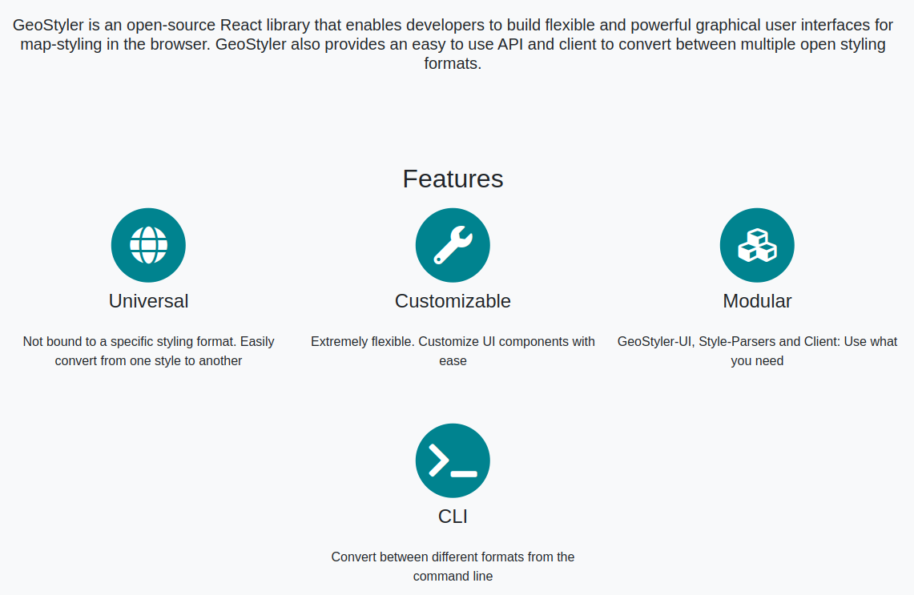
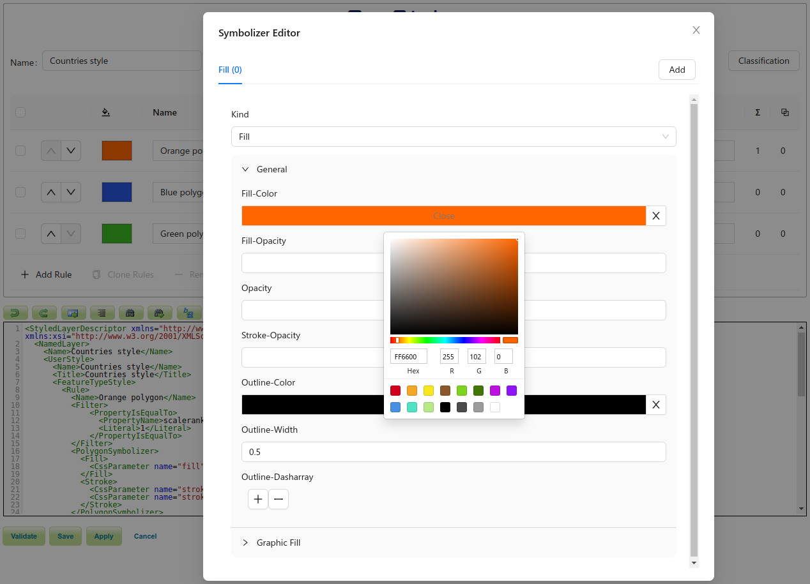

From Monday, 08.05 until Friday, 12.05.2023 the second GeoStyler Code Sprint took place. 12 motivated coders from all over the world participated and provided great contributions to the GeoStyler project.

{/* truncate */}

We want to thank everyone who contributed to the GeoStyler project. Thank you for your motivation and engagement, for all your great contributions, for all the ideas that came up during the code sprint and for all the fun we had during this week! You are awesome!

Thank you 

[@slafayIGN](https://github.com/slafayIGN),
[@geographika](https://github.com/geographika),
[@ocruze](https://github.com/ocruze),
[@pprev94](https://github.com/pprev94),
[@dnlkoch](https://github.com/dnlkoch),
[@kaivolland](https://github.com/kaivolland),
[@hwbllmnn](https://github.com/hwbllmnn),
[@jansule](https://github.com/jansule),
[@SchulA](https://github.com/SchulA),
[@OSHistory](https://github.com/OSHistory),
[@marcjansen](https://github.com/marcjansen)
and [@ahocevar](https://github.com/ahocevar).

 

## Sponsors

We also want to thank the sponsors of this year's code sprint:

<!-- FOSSGIS logo is imported differently to enable specifying the height -->
<!-- OSGeo logo in SVG cannot be imported like FOSSGIS logo, it uses the "normal" markdown image inclusion -->

import logoFossgis from '/img/logo-fossgis.png'

Thank you, [OSGeo](https://www.osgeo.org/), for sponsoring the social event!

Thank you, [FOSSGIS e.V.](https://www.fossgis.de/), for sponsoring the catering for the whole week!

We also want to thank [terrestris GmbH & Co. KG](https://www.terrestris.de) for providing the facilities and handing out these great GeoStyler cups!

Additional thanks to all companies that supported this event by allowing their employees to participate!

All of this helped us strengthening the bonds between all participants and thereby, you play an important
role in growing the GeoStyler community.

## Contributions

During the Code Sprint, we achieved the following:

 

### GeoStyler CLI

The [GeoStyler CLI](https://github.com/geostyler/geostyler-cli) can now additionally be used as standalone executable! There is no need to install Node.js anymore, if you just want to convert between different styling formats without using the UI. The executables can be downloaded for each version from the [repository](https://github.com/geostyler/geostyler-cli/releases). We support Linux, MacOS and Windows.

Besides that, some maintenance work was done on the repository and semantic-release was enabled.

Kudos to [@geographika](https://github.com/geographika) and [@jansule](https://github.com/jansule).

### GeoStyler Converter

We now have a new demo application that solely focusses on the conversion between different styling formats: [GeoStyler Converter Demo](https://geostyler.github.io/geostyler-converter-demo/). Paste a style into one of the editors, edit the style and convert it into any other format. Some final polishing is still in the making, but the GeoStyler Converter Demo can already be used. See also the [geostyler-converter-demo repository](https://github.com/geostyler/geostyler-converter-demo/).

Kudos to [@slafayIGN](https://github.com/slafayIGN), [@ocruze](https://github.com/ocruze) and [@pprev94](https://github.com/pprev94).

### Support for Expressions in the UI

After setting the basement for the usage of expressions in the last code sprint in 2022, the GeoStyler UI now also supports expressions. Users are now enabled to create styling rules based on attributes of their dataset. Colors, sizes, strokes, etc. can now all be computed with values derived from the geodata itself. So if you want the size of a point representing a city being proportional to the number of its inhabitants, this can now be easily achieved. Many real-world styling challenges can now be adressed in an appropriate, compact and flexible way. And the best part of it: There is no need to write the expressions by hand. The UI provides a graphical editor just for that. Now, the parsers need to be updated to fully support this feature.

Kudos to [@kaivolland](https://github.com/kaivolland).

### GeoStyler UI

Besides the support for expressions, the GeoStyler UI was improved in various ways. We are currently adding icons to options in dropdowns, so users can directly see what an option stands for. What was the difference again between `butt`, `round`, and `square` line caps? The answer will be directly graspable from the editor.

We also cleaned up some dependencies, make use of [Vite](https://vitejs.dev/) for creating our browser builds, improved the test performance, and upgraded to antd 5. As part of this, we replaced the windows with antd modals and did some polishing here and there.

The previously introduced `GeoStylerContext` was also implemented in various components, which will simplify adjusting the GeoStyler UI to your needs.

Kudos to [@dnlkoch](https://github.com/dnlkoch), [@SchulA](https://github.com/SchulA), [@jansule](https://github.com/jansule) and [@hwbllmnn](https://github.com/hwbllmnn).

### GeoStyler Mapbox Parser

We spent quite some time discussing the [geostyler-mapbox-parser](https://github.com/geostyler/geostyler-mapbox-parser) and how we can integrate the concept of map-based styles (which mapbox is using) in addition to layer-based styles (which SLD is using) in GeoStyler. We came to the conclusion that layers in mapbox fit quite well to the idea of rules in layer-based styles. Both are entities consisting of filters, scale denominators and styling instructions. With the support for expressions in GeoStyler in particular, we should now be able to advance the development of the geostyler-mapbox-parser and make it a first class citizen in the GeoStyler ecosystem.

Besides that, the geostyler-mapbox-parser was enhanced by splitting or merging styling rules where needed. A consistent style structure after parsing is still being maintained by enriching the mapbox-style with metadata.

Kudos to [@ocruze](https://github.com/ocruze), [@pprev94](https://github.com/pprev94), [@slafayIGN](https://github.com/slafayIGN), [@kaivolland](https://github.com/kaivolland), [@jansule](https://github.com/jansule) and [@ahocevar](https://github.com/ahocevar).

### GeoStyler Homepage

The [GeoStyler homepage](https://geostyler.org/) was updated to provide better information about the idea of GeoStyler and the different tools that it provides. GeoStyler is more than just a UI library!

 

Kudos to [@OSHistory](https://github.com/OSHistory), [@geographika](https://github.com/geographika) and [@jansule](https://github.com/jansule).

### GeoStyler SymCore Parser

We added a new parser to the GeoStyler ecosystem: the [geostyler-symcore-parser](https://github.com/geostyler/geostyler-symcore-parser). This parser will allow the conversion between geostyler-style and the new [OGC Styles & Symbology Models and Encodings - Part 1: Core](https://github.com/opengeospatial/styles-and-symbology) standard. For now, the parser only contains the typings of the standard, but will be implemented in the future. This parser should facilitate the switch to the new standard and will hopefully increase the adoption of it.

Kudos to [@kaivolland](https://github.com/kaivolland) and [@jansule](https://github.com/jansule).

### GeoStyler GeoServer Plugin

The [geostyler-geoserver-plugin](https://github.com/geostyler/geostyler-geoserver-plugin) was updated to use the latest version of GeoStyler. Additionally, multiple bugs were fixed and the build artifacts are now being published on [nexus.terrestris.de](https://nexus.terrestris.de/#browse/browse:geoserver-extras:org%2Fgeoserver%2Fcommunity%2Fgs-geostyler). Instructions on how to download and use the build artifacts were added to the README.

Kudos to [@dnlkoch](https://github.com/dnlkoch), [@hwbllmnn](https://github.com/hwbllmnn) and [@marcjansen](https://github.com/marcjansen).

### Miscellaneous

Users will now be redirected to the [GeoStyler homepage](https://geostyler.org/) when going to [geostyler.github.io](https//geostyler.github.io/).

The [geostyler-cql-parser](https://github.com/geostyler/geostyler-cql-parser/) was fixed, so that it can be directly used without the need to add configurations to webpack.

The GeoStyler repositories are now transitioning to using issue forms instead of templates. This should lower the barrier for non-technical users to create issues and thereby helping GeoStyler becoming a more welcoming community. See for example the issue form for a [feature request](https://github.com/geostyler/geostyler/issues/new?assignees=jansule%2CKaiVolland&labels=enhancement&projects=&template=feature_request.yaml).

The [GeoStyler Beginner Workshop](https://geostyler.github.io/geostyler-beginner-workshop/) is currently being updated and will use Docusaurus instead of Jekyll as static site generator. The content of the workshop will also be updated in the future, to reflect the latest state of GeoStyler.

The robustness of [geostyler-rest](https://github.com/geostyler/geostyler-rest) was improved by better handling unknown input and output formats, or inconsistent styles.

Kudos to [@slafayIGN](https://github.com/slafayIGN), [@OSHistory](https://github.com/OSHistory) and [@jansule](https://github.com/jansule).

### Conference talks and other media

GeoStyler will be featured on multiple talks on FOSS4G 2023.

Kudos to everyone!

Again, we want to thank everyone who participated in this Code Sprint. It was great fun and an absolute pleasure working with you! We are already looking forward to the next GeoStyler Code Sprint.