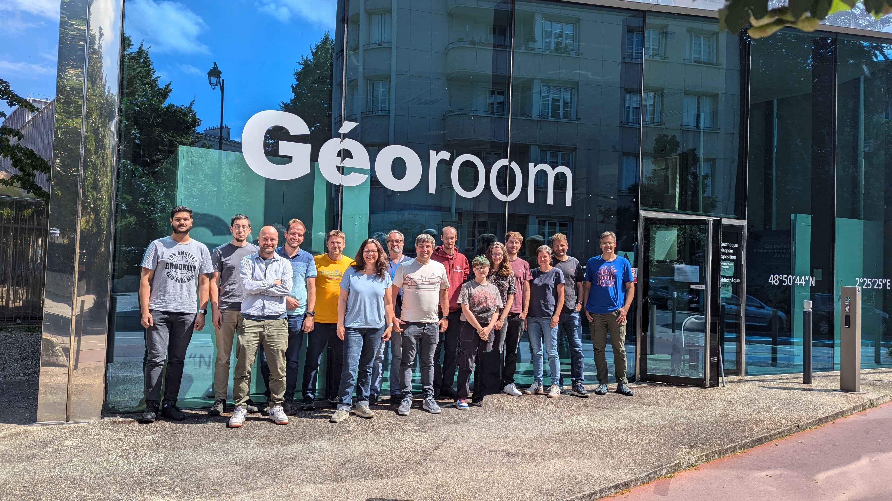
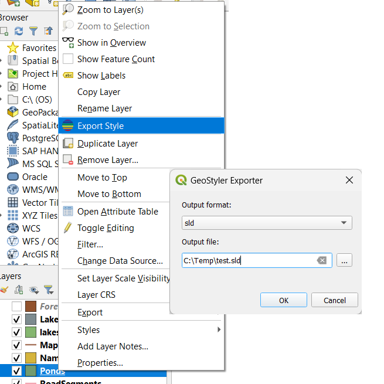
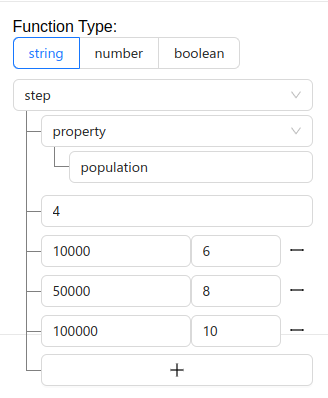
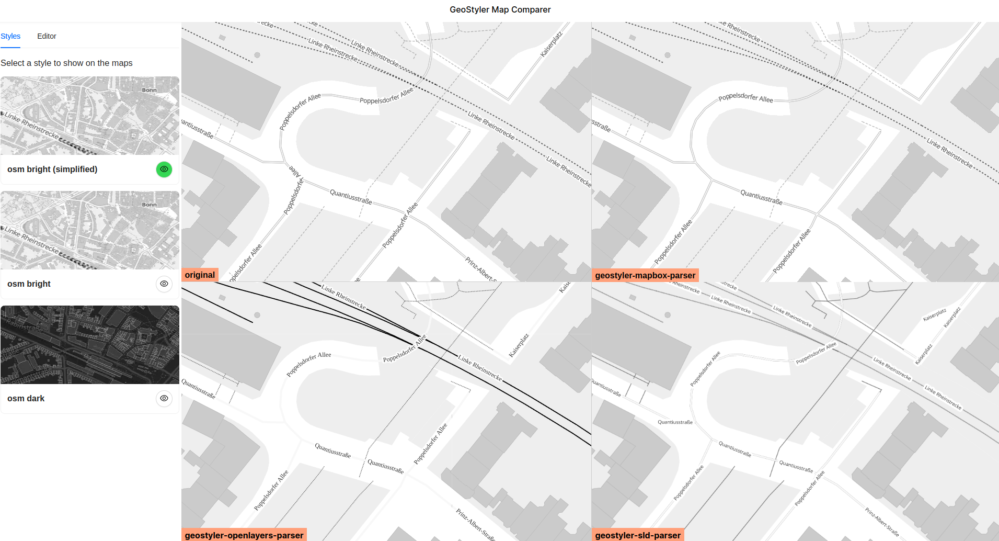
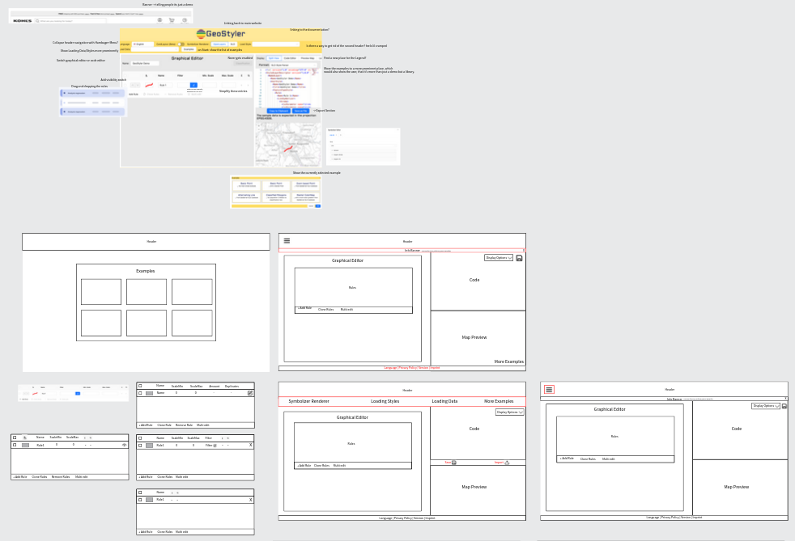
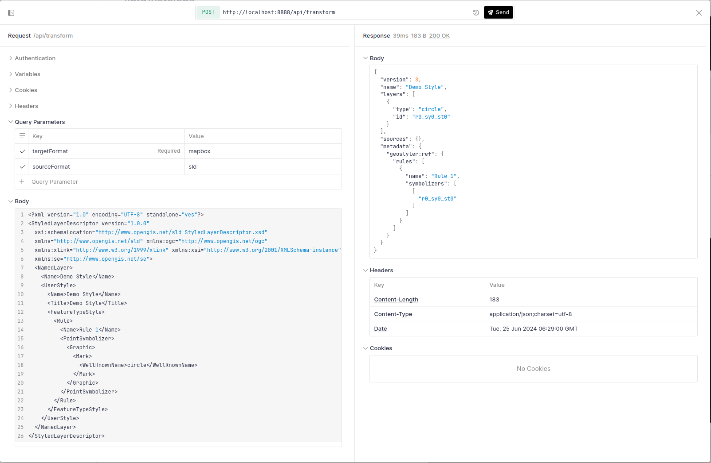
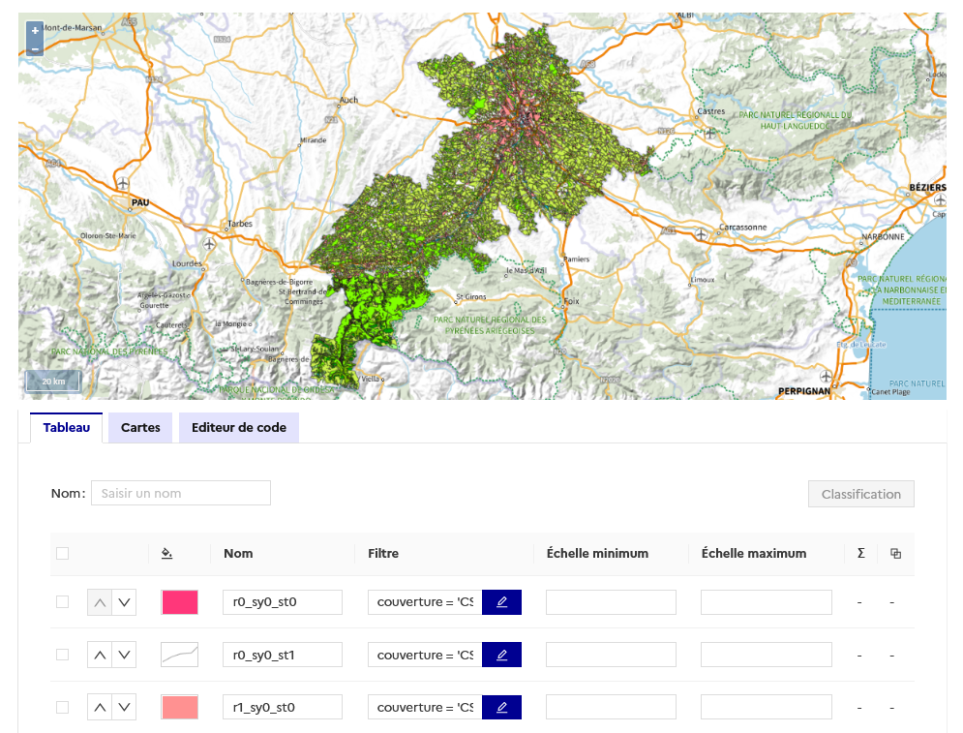
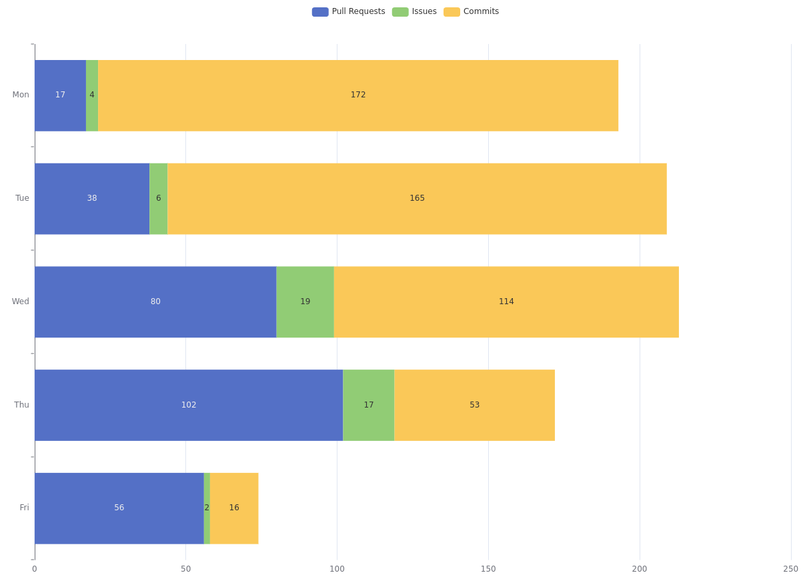

From Monday, 17.06 until Friday, 21.06.2024 the third GeoStyler Code Sprint took place in the offices
of [IGN](https://www.ign.fr) in Paris, France. 16 motivated coders from France, Germany and Switzerland
participated and provided great contributions to the GeoStyler project.

{/* truncate */}

We want to thank everyone who contributed to the GeoStyler project. Thank you for your motivation and engagement,
for all your great contributions, for all the ideas that came up during the code sprint and for all the fun
we had during this week! You are awesome!

Thank you 

[@kaivolland](https://github.com/kaivolland),
[@hwbllmnn](https://github.com/hwbllmnn),
[@jansule](https://github.com/jansule),
[@geographika](https://github.com/geographika),
[@slafayIGN](https://github.com/slafayIGN),
[@ocruze](https://github.com/ocruze),
[@pprev94](https://github.com/pprev94),
[@jwkaltz](https://github.com/jwkaltz),
[@ger-benjamin](https://github.com/ger-benjamin),
[@linegallen](https://github.com/linegallen),
[@sarastreit](https://github.com/saraStreit),
[@myriamfischer](https://github.com/myriamfischer),
[@thomasmarti](https://github.com/thomasmarti),
[@eschuh](https://github.com/eschuh),
[@bsteinemann](https://github.com/bsteinemann),
[@antonellostruzzolino](https://github.com/antonellostruzzolino)!

 

## Sponsors

We also want to thank the sponsors of this year's code sprint:

import logoIGN from '/img/logo-ign.jpg'

 

import logoFossgis from '/img/logo-fossgis.png'

 

Thank you, [IGN](https://www.ign.fr), for hosting the code sprint and providing the fantastic catering!

Thank you, [FOSSGIS e.V.](https://www.fossgis.de/), for funding the travel expenses for many of our participants!

Thank you, [Pozi](https://pozi.com/) and all other [OpenCollective contributors](https://opencollective.com/geostyler), for sponsoring the social event!

Thank you, [terrestris GmbH & Co. KG](https://www.terrestris.de), for handing out these great GeoStyler cups!

Additional thanks to all companies that supported this event by allowing their employees to participate!

Without you the code sprint would not be possible and we would miss out on such a great community!

So thank you,
[@camptocamp](https://github.com/camptocamp),
[@compassinformatics](https://github.com/compassinformatics),
[@IGNF](https://github.com/IGNF),
[@kanton-aargau](https://github.com/kanton-aargau),
[@terrestris](https://github.com/terrestris)!

## Contributions

During the Code Sprint, we achieved the following:

### GeoStyler ArcGIS Parser

One of the probably biggest and hopefully most impactful achievements is the
introduction of the [geostyler-lyrx-parser](https://github.com/geostyler/geostyler-lyrx-parser) which allows
for parsing of ArcGIS Pro styles (.lyrx format)! The parser is based on the [GeoCat/bridge-style](https://github.com/GeoCat/bridge-style)
and was ported from Python into TypeScript. It is now integrated into the GeoStyler ecosystem, so that it integrates seamlessly with all the other existing parsers! That means that it is now possible to convert
ArcGIS styles to QGIS, Mapbox, OpenLayers, and SLD! So far reading ArcGIS Pro styles with
features layers, meaning point, line, polygon or text classes, with margin, padding, offset, colors and more is possible! Expressions are already implemented but need some corrections. Handling icons is a work in progress.

Kudos to 
[@ger-benjamin](https://github.com/ger-benjamin),
[@jwkaltz](https://github.com/jwkaltz),
[@myriamfischer](https://github.com/myriamfischer),
[@thomasmarti](https://github.com/thomasmarti),
[@eschuh](https://github.com/eschuh),
[@bsteinemann](https://github.com/bsteinemann).

Besides that, an ArcGIS integration was created that allows for visually comparing ArcGIS styles with their SLD equivalents,
making use of the [GeoStyler REST API](https://github.com/geostyler/geostyler-rest).

Kudos to 
[@myriamfischer](https://github.com/myriamfischer),
[@thomasmarti](https://github.com/thomasmarti),
[@eschuh](https://github.com/eschuh),
[@bsteinemann](https://github.com/bsteinemann).

### GeoStyler QGIS Plugin

Making use of the [geostyler-cli](https://github.com/geostyler/geostyler-cli),
a new QGIS Plugin called [geostyler-qgis-plugin](https://github.com/geostyler/geostyler-qgis-plugin)
was created that allows exporting layer styles from QGIS into the other formats supported by GeoStyler. In the future, we also intend
to extend the plugin with importing capabilities, so that users are able to import other styling formats into QGIS.

Kudos to
[@geographika](https://github.com/geographika),
[@jansule](https://github.com/jansule).

### GeoStyler CLI

Dependencies in the [geostyler-cli](https://github.com/geostyler/geostyler-cli) were upgraded to their latest versions. Furthermore,
the executing commands for the different environments such as node, npx, binary executable, were harmonized. For all environments,
the executing command will now be `geostyler-cli`!

Kudos to
[@geographika](https://github.com/geographika),
[@jansule](https://github.com/jansule).

### GeoStyler-Style

The [geostyler-style](https://github.com/geostyler/geostyler-style) was extended with additional function expressions.
The basic casting expressions `toNumber` and `toString` were added, which allow for converting values to numbers and
strings, respectively. Additionally, `step` and `interpolate` expressions will now be supported, making it possible
to provide categorized and interpolated values.

Kudos to
[@kaivolland](https://github.com/kaivolland),
[@jansule](https://github.com/jansule).

### GeoStyler Mapbox Parser

The [geostyler-mapbox-parser](https://github.com/geostyler/geostyler-mapbox-parser) now successfully reads colors as hex-codes
as well as RGBA strings into the GeoStyler style. This works for both hardcoded color values and color values in (nested) expressions.
Also the parser now supports the newly introduced `interpolate` expression.

Kudos to
[@jansule](https://github.com/jansule).

### GeoStyler SLD Parser

The usability of the [geostyler-sld-parser](https://github.com/geostyler/geostyler-sld-parser) was improved by automatically reading
the version of a given SLD from the style itself. Through this, it is now possible to up-/downgrade SLDs while using only a
single instance of the parser. Additionally, the geostyler-sld-parser now supports translating its error messages into multiple languages,
which allows for easier communicating styling errors with the style editors.

Kudos to
[@ocruze](https://github.com/ocruze),
[@pprev94](https://github.com/pprev94).

### GeoStyler UI

The [GeoStyler UI](https://github.com/geostyler/geostyler) was improved by adding an upload file button to the code editor.
Additionally, the expressions UI was extended with elements for the `case` and `step` function expressions.

Kudos to
[@kaivolland](https://github.com/kaivolland),
[@pprev94](https://github.com/pprev94).

### GeoStyler Visual Comparator

A not-yet published tool for visually comparing different styles that were processed by GeoStyler was improved by adding
additional styles to compare and tweaking the UI.

Kudos to 
[@jansule](https://github.com/jansule).

### GeoStyler Homepage Design

A new design concept for the GeoStyler Homepage was created that serves all static content at one place. As part of that,
the homepage, tutorials, showcases, demo applications and more should all be directly accessible from
the homepage. The new design is intended to better deliver the message of GeoStyler while still being easy to maintain.

Kudos to
[@linegallen](https://github.com/linegallen),
[@sarastreit](https://github.com/saraStreit),
[@antonellostruzzolino](https://github.com/antonellostruzzolino),
[@slafayIGN](https://github.com/slafayIGN),
[@jansule](https://github.com/jansule).

### ESModule Builds

The GeoStyler packages were harmonized and now all provide ESModule builds in their distributions. We also moved from
webpack to vite and vitest in order to simplify our tooling.

Kudos to
[@kaivolland](https://github.com/kaivolland),
[@hwbllmnn](https://github.com/hwbllmnn).

### GeoStyler REST

The [GeoStyler REST API](https://github.com/geostyler/geostyler-rest) received some updates and now makes use
of bun.

Kudos to
[@kaivolland](https://github.com/kaivolland).

### GeoStyler and the French State Design System

IGN started working on integrating the GeoStyler UI components into applications using the
[French State Design System](https://www.systeme-de-design.gouv.fr/),
showcasing the customization possibilities of these components.

Kudos to
[@ocruze](https://github.com/ocruze).

### Additional achievements

Besides the above mentioned achievements, we also managed to upgrade dependencies, updated pipelines to
include semantic-release and webhooks that notify our discord users about published releases,
for many of our repositories. It is now also possible to publish beta releases in order to try out
experimental features.

Kudos to
[@hwbllmnn](https://github.com/hwbllmnn),
[@kaivolland](https://github.com/kaivolland),
[@bsteinemann](https://github.com/bsteinemann),
[@geographika](https://github.com/geographika),
[@jansule](https://github.com/jansule).

### Stats

We especially want to welcome our new contributors to the GeoStyler project! We are happy for a
growing community and are looking forward to the future development of the GeoStyler project.

Again, we want to thank everyone who participated in this Code Sprint. It was great fun and an absolute
pleasure working with you! We are already excited to see you again on the next GeoStyler Code Sprint.